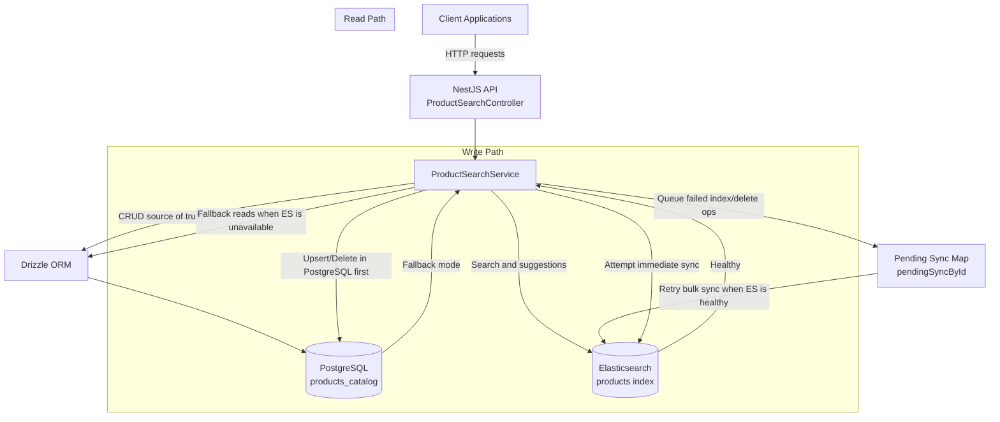
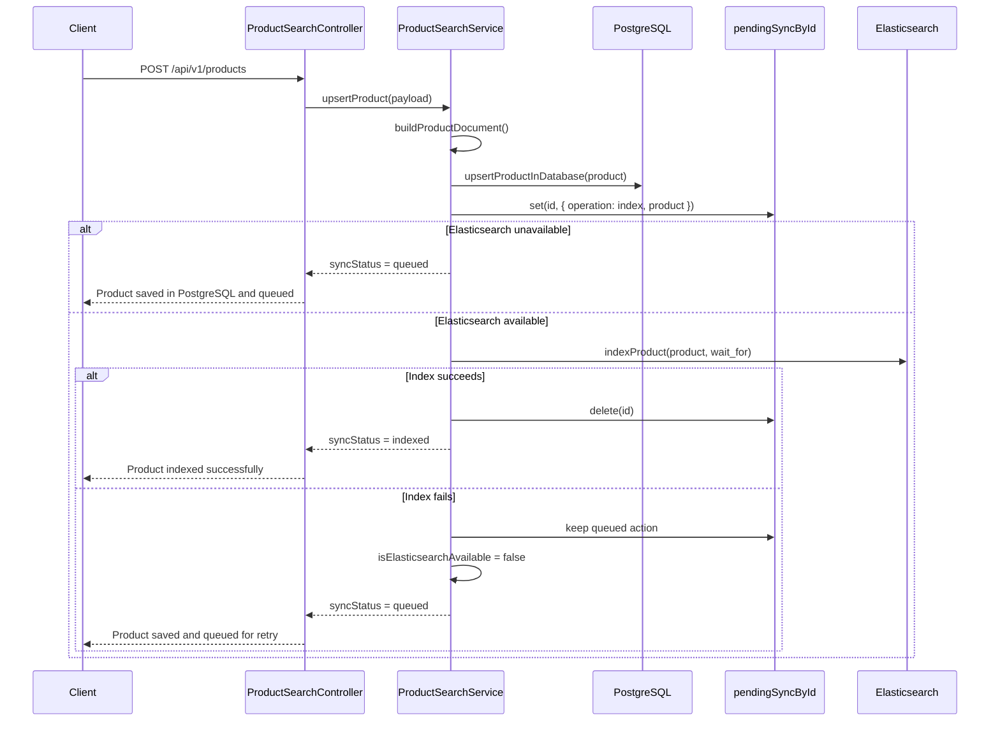
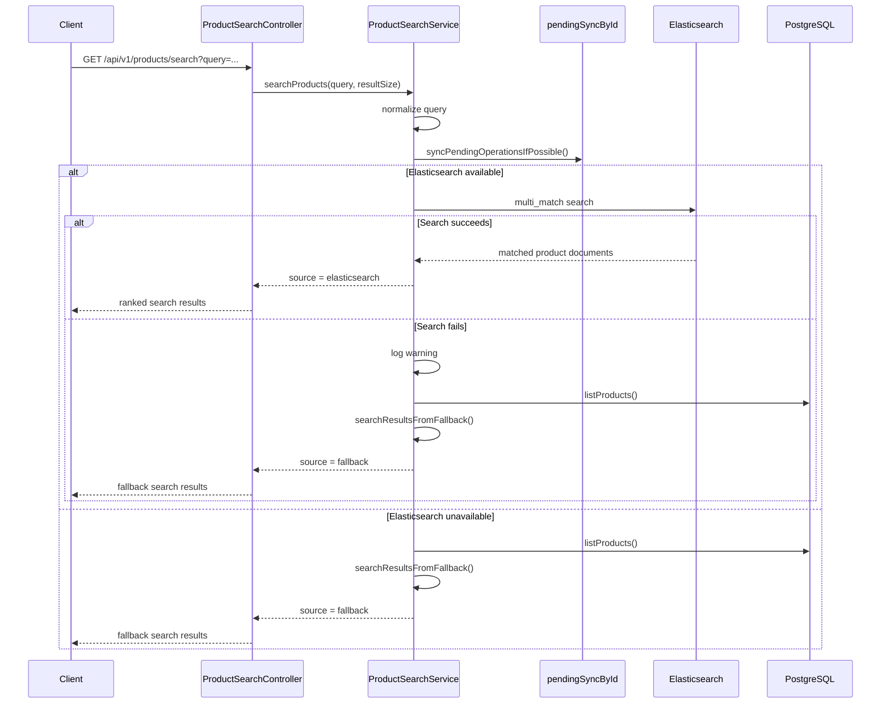

# Product Search Service High Level Design

## Purpose

This service provides product search and suggestions with two execution modes:

- Primary mode: Elasticsearch-backed indexing and querying.
- Resilience mode: PostgreSQL-backed fallback with eventual synchronization.

The design goal is to keep API write and read endpoints available even when Elasticsearch is temporarily unavailable.

## Core Responsibilities

- Maintain a PostgreSQL product catalog as the source of truth.
- Keep Elasticsearch index in sync for fast full-text search and autocomplete.
- Queue failed Elasticsearch sync operations and retry them later.
- Return clear sync status to clients for write operations.

## Main Components

- Product catalog: PostgreSQL table accessed through Drizzle ORM.
- Elasticsearch client: External index and query engine.
- Availability flag: Runtime health indicator for Elasticsearch reachability.
- Pending sync map: Per-product queue of operations to replay later.

## High-Level Architecture Diagram

Flow summary:

- PostgreSQL is the source of truth for product data.
- Elasticsearch is the search index used when available.
- Failed Elasticsearch writes are captured in the pending sync map and replayed later.
- Read requests prefer Elasticsearch and fall back to PostgreSQL-backed logic during outages.

## Sequence Diagram: Upsert Product

## Sequence Diagram: Search Product

## Startup Flow

On module initialization:

1. Ping Elasticsearch.
2. Ensure product index exists with required mappings.
3. Seed PostgreSQL catalog when the table is empty.
4. Seed Elasticsearch index from PostgreSQL when index is empty.
5. Mark Elasticsearch as available.
6. Attempt syncing any queued operations.

If any step fails:

- Mark Elasticsearch as unavailable.
- Continue serving requests using fallback logic.

## Data and Index Shape

Indexed document fields:

- id as keyword.
- name, description, category, brand, tags as text.
- price as float.
- inStock as boolean.
- suggest as completion field.

The suggest field is derived from name, brand, category, and tags for autocomplete.

## Read Path: Suggestions

Request flow:

1. Attempt to flush pending sync operations when Elasticsearch is available.
2. Normalize query.
3. If query is empty, return empty suggestions.
4. If Elasticsearch is unavailable, execute PostgreSQL-backed suggestion fallback.
5. If available, query completion suggester.
6. Deduplicate returned suggestion texts.

Failure handling:

- On Elasticsearch query error, log warning and return fallback suggestions.

## Read Path: Search

Request flow:

1. Attempt to flush pending sync operations when Elasticsearch is available.
2. Normalize query.
3. If query is empty, return empty result set.
4. If Elasticsearch is unavailable, run PostgreSQL-backed scoring fallback.
5. If available, run multi-match search using weighted fields.

Field weighting strategy:

- name boosted highest.
- brand and category moderately boosted.
- description and tags included with lower influence.
- fuzziness enabled for typo tolerance.

Failure handling:

- On Elasticsearch query error, log warning and return fallback search results.

## Write Path: Upsert Product

Upsert sequence:

1. Build normalized product document.
2. Upsert into PostgreSQL first.
3. Queue pending index action for that product id.
4. If Elasticsearch unavailable, return queued status immediately.
5. If available, attempt immediate indexing.
6. On success, remove queued action and return indexed status.
7. On failure, keep queued action, mark Elasticsearch unavailable, return queued status.

Why queue before immediate indexing:

- Guarantees the sync intent is captured before external I/O.
- Prevents lost sync intent during partial failures.
- Supports at-least-once eventual synchronization semantics.

## Write Path: Delete Product

Delete sequence:

1. Remove from PostgreSQL catalog.
2. Queue pending delete action for that id.
3. If Elasticsearch unavailable, return queued status.
4. If available, attempt immediate delete from index.
5. On success, remove queued action and return indexed status.
6. On failure, keep queued action, mark Elasticsearch unavailable, return queued status.

## Pending Sync Engine

The pending sync map stores one latest action per product id:

- Index action with full product document.
- Delete action with product id.

Sync behavior:

1. Build Elasticsearch bulk operations from queued actions.
2. Execute bulk with refresh wait-for semantics.
3. If partial failures occur, remove only successful ids from queue.
4. Keep failed ids queued for later retry.
5. On bulk exception, mark Elasticsearch unavailable and retry on later calls.

This strategy avoids dropping writes and enables gradual recovery.

## Fallback Search Behavior

Fallback suggestion mode:

- Matches product names containing the query.
- Applies uniqueness and size limits.

Fallback search mode:

- Builds a simple relevance score over name, brand, category, description, and tags.
- Prioritizes name prefix and name contains matches.
- Returns sorted and size-limited results.

## Consistency Model

- API writes are accepted into PostgreSQL first.
- Elasticsearch becomes eventually consistent with API state.
- During outages, reads continue from fallback.
- After recovery, queued operations reconcile index state.

## Operational Notes

- Runtime flag transitions from unavailable to available only after successful initialization.
- Failures during query/write/sync can flip the flag back to unavailable.
- Future requests continue to work due to fallback and queued retries.

## Summary

This service is designed for high availability at the API layer:

- Fast search when Elasticsearch is healthy.
- Graceful degradation when it is not.
- Eventual index consistency through queue-first write tracking and retry synchronization.